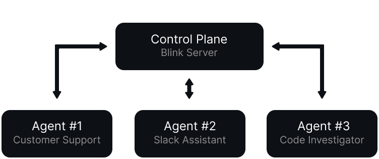

<a href="https://blink.coder.com#gh-dark-mode-only">

</a>
<a href="https://blink.coder.com#gh-light-mode-only">

</a>

[](https://discord.gg/coder)

[](https://blink.coder.com/docs)

Blink is a self-hosted platform for deploying custom AI agents. It ships with a built-in agent tooled for coding tasks and deep code research.
Work alongside Blink agents in GitHub, the web UI, or in threaded Slack conversations.
Tailor the included agent with new tools and prompts, or build new agents in TypeScript with the Blink SDK.


## Use Cases

- **Understanding complex codebases** - ask questions about how a repo works, how parts connect, or where to start when the code is unfamiliar.
- **Coding partner in Slack** - discuss ideas, open GitHub issues, or handle small coding tasks directly in Slack without breaking the conversation.
- **Investigating GitHub issues** - have Blink gather context, reproduce issues, or summarize findings before opening or updating an issue.
- **Customer support in shared channels** - let your customers ask technical questions in shared Slack channels and get answers backed by citations from your codebase and documentation.

<p align="center">
  
</p>

## Features

- **Pre-built, fully-functional [Scout agent](./packages/scout-agent/README.md)**, which you can customize for your own use
- **Web UI** where you can chat with agents
- **Blink SDK** - a set of libraries for building agents compatible with the Blink platform
- **Blink CLI** - a command-line tool for developing agents locally
- **Observability** - use the web UI to view logs and traces
- **Docker-based deployment** - agents are deployed as Docker containers
- **User and organization management** - invite your team to use and collaborate on agents

## Get Started

### Requirements

- Node.js 22+ or Bun
- Docker (the server needs it to deploy agents)

### Install and run the Blink server

```sh
npm install -g blink-server
blink-server
```

Open the Blink web UI in your browser and create your first agent. Alternatively, you may run the server [with Docker](https://blink.coder.com/docs/server/docker-deployment).

## What's a Blink agent?

Agents are HTTP servers that respond to events. The Blink Server deploys them as Docker containers, routes messages from Slack/GitHub/web UI, and manages conversation state - your agent just defines how to respond.

```typescript
import { convertToModelMessages, streamText } from "ai";
import * as blink from "blink";

const agent = new blink.Agent();

agent.on("chat", async ({ messages }) => {
  return streamText({
    model: "anthropic/claude-opus-4.6",
    messages: convertToModelMessages(messages),
    system: "You are a helpful assistant.",
  });
});

agent.serve();
```

The `on("chat")` handler processes incoming messages. For tool calls, the server automatically loops back to your agent until the response is complete.

For a closer look at Blink agents, visit [blink.coder.com/docs](https://blink.coder.com/docs).

## Current State of the Project

We've been using Blink at [Coder](https://coder.com) for a few months now. We built in-house agents that:

- help our customers in Slack with questions related to the Coder product by analyzing the [coder/coder repository](https://github.com/coder/coder)
- automatically diagnose flaky tests in our CI pipeline, create [issues](https://github.com/coder/internal/issues/1278), and assign relevant engineers to fix them
- answer questions from our sales team by aggregating data from our CRM and sales tools

and more.

That being said, Blink is still in early access. You may encounter bugs and missing features. If you do, please [file an issue](https://github.com/coder/blink/issues/new).

## License

Server code is licensed under AGPLv3. Agent SDKs are licensed under MIT.
